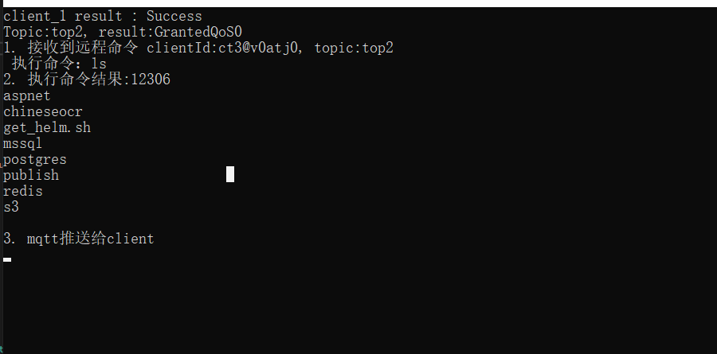

##### 基于环信mqtt服务的shell远程命令执行

###### 简介：
 通过MQTT远程执行shell命令
###### 优势：
- 相比传统端到端SSH具有较强解耦和长连接保持的优势，消息也更加持久
- 吞吐量速度提升
- 网络开销降低
- 服务质量上，MQTT支持三种不同级别的服务质量，为不同场景提供消息可靠性：
- 客户端发送消息，推送给未来的订阅者，并支持命令分发执行
###### 使用说明：

##### MQTTAppWeb
- web-terminal:
 web输入命令端，需配置websocket连接。
- MQTT-Client:
 Web客户端后台，监听发布订阅消息，编码命令并推送组装的内容。需要在appsettings.Development.json 配置MQTT连接配置。
- MQTT-Center:
 MQTT 中介端，如：环信
##### MQTTServer
- MQTT-Server:
 MQTT 服务端，接受包含命令的消息，解析命令，SSH方式连接服务器并执行命令。执行完毕发送通知。需配置MQTT连接配置和SSH连接。
##### MQTTnet.App
- Common:
 公共组件，负责MQTT连接调试，也可以作为桌面端命令发送客服端
 
###### web端输入命令
 
 
###### 服务器端接收到命令
 

 ###### 服务器端执行命令并返回结果
 
 
 ##### 引用
   [xterm.js](https://github.com/xtermjs/xterm.js)

